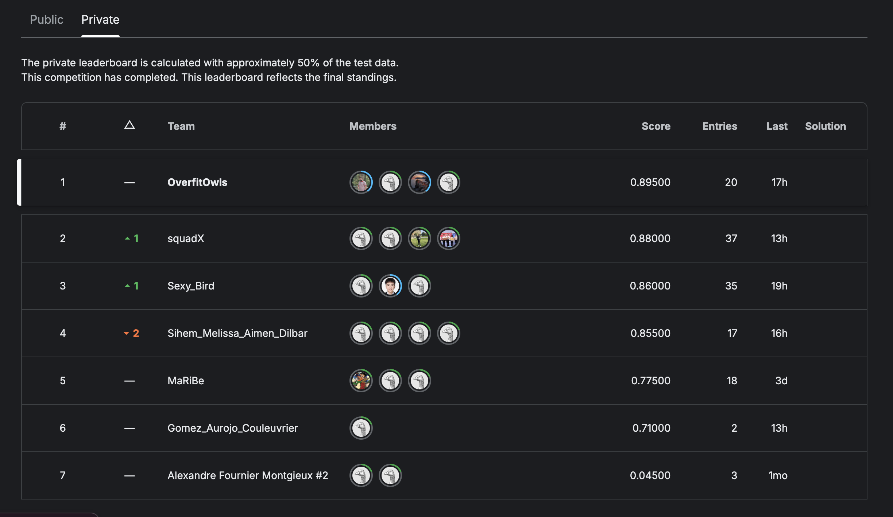

# Multi-class Classification of Bird Species for BDMA 7 Machine Learning Kaggle Competition

Adapted from [here](https://github.com/pytorch/vision/tree/main/references/classification)

## Instructions

Use Python 3.11 with NVIDIA GPU.

- `pip3 install requirements.txt`
- `python3 train.py` OR in slurm cluster: `sbatch job.slurm` (contains hyperparameter configuration for best submission)
- (Optional) Run object detection notebook for cropping images

We came 1st in the competition 😊 

Read more about our approach in `report.pdf`.
